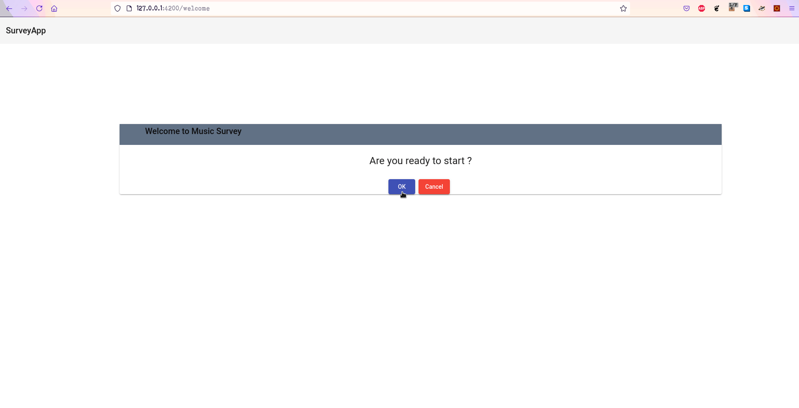

# SurveyApp

This is A survey App ispired from my previous one [Survey App Javascript](https://github.com/giacco/SurveyApp).

This project was generated with [Angular CLI](https://github.com/angular/angular-cli) version 12.0.1.

## Backend Server
This app use a simple [Survey Server](./server/README.md) as backend.
Read the read me on how to build and run

## How to use
clone this repo:
* `git clone https://github.com/giacco/Angular-SurveyApp.git`  
* `cd Angular-SurveyApp` 
* run `npm install` to install dependencies
* build and run the [Backend Server](./server/README.md)
* run `npm start` to start the Development server (Front End Application)

## Development server
Run `ng serve` for a dev server. Navigate to `http://localhost:4200/`. The app will automatically reload if you change any of the source files.

## Build

Run `ng build` to build the project. The build artifacts will be stored in the `dist/` directory.

## TODO
- [ ] write unit tests
- [ ] write end-to-end tests

## Demo

